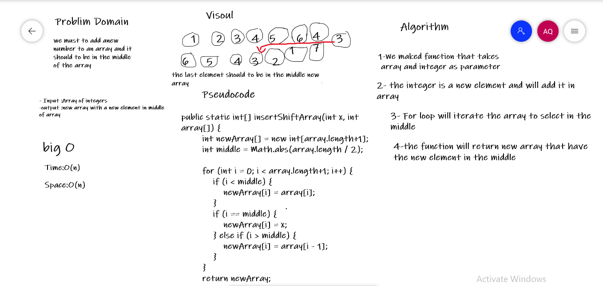

# Insert to Middle of an Array

We should to add new element in new array and to be in the middle this array

## Whiteboard Process

## Approach & Efficiency

1-We maked function that takes
 array and integer as parameter

2- the integer is a new element and will add it in array

3- For loop will iterate the array to select in the middle

4-the function will return new array that have the new element in the middle