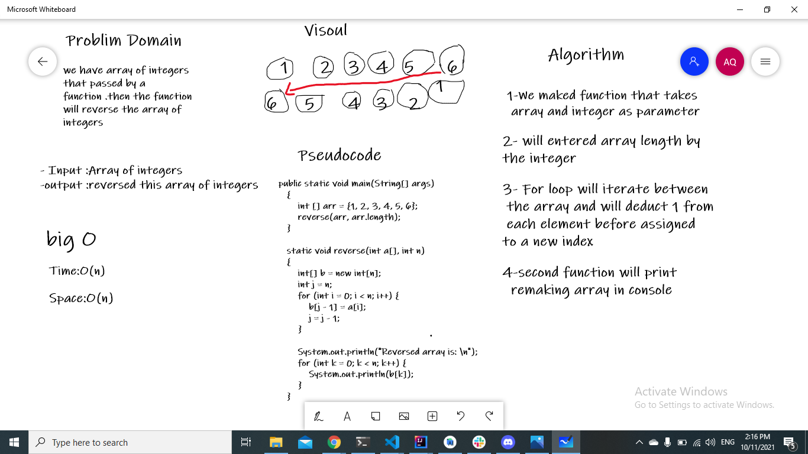

# Reverse an Array

The challenge is how to return array with elements in reversed way elements

## Whiteboard Process

## Approach & Efficiency

I'm think for long time how to solve it , and finally find that the way it using function that takes two parameters , an array and an integer